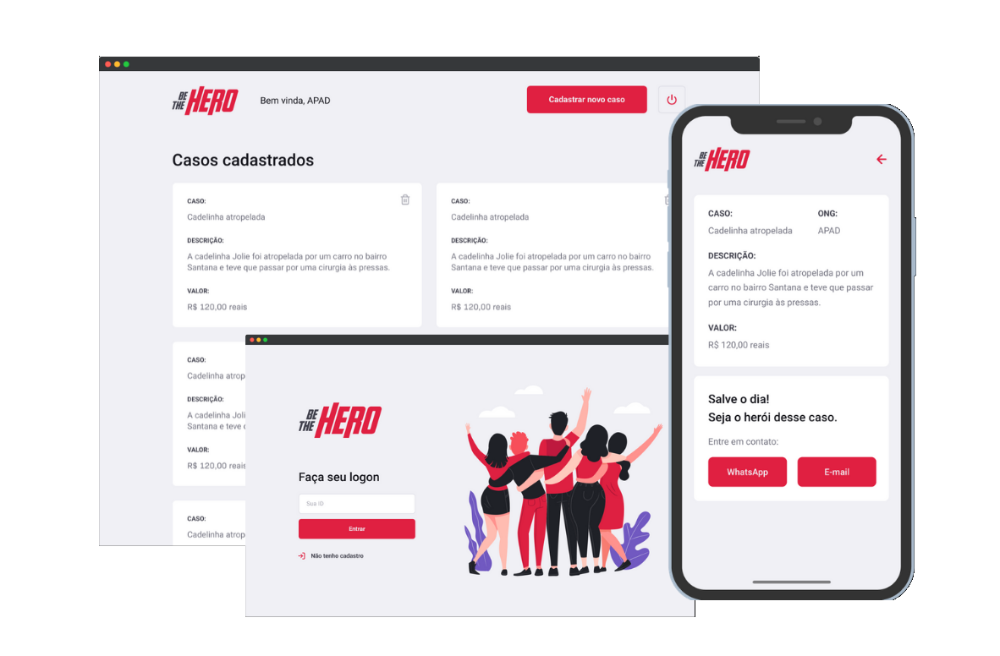

<p align="center">
  
</p>
<p align="center">
  App to help NGOs built with ReactJS, React Native, Node.js and more. 


</p>


##  💻 Project

  BeTheHero is a project that aims to connect people who want to make monetary 
  contributions to NGOs (non-governmental organizations) that need help.

## :rocket: Technologies

- Node.js
- React
- React Native
- Expo
- Express
- Nodemon
- Axios
- Cors
- SQLite3
- Jest

## :information_source: How To Run

```bash
# Clone this repository 
$ git clone https://github.com/rodrigo7331/bee-the-hero

# Go into the repository
$ cd be-the-hero/frontdend or mobile

# Install dependencies 
$ yarn install

# Run the app 
$ yarn start to run web or expo start to run mobile
```

